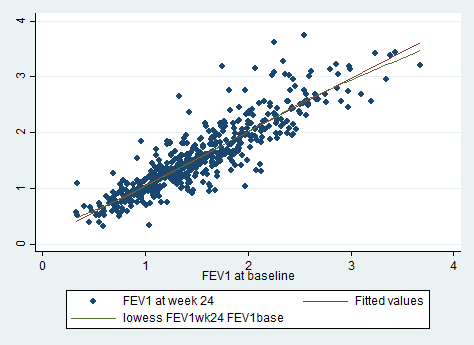

# Introduction
Each statistics and biostatistics department around the world, in conjunction with their collaborators (for us at the University of Washington this includes departments like Epidemiology and Global Health), must choose a statistical software to teach in introductory courses. At the University of Washington, STATA has been taught for many years. While STATA is a powerful software, with relatively user-friendly syntax, it is not very flexible. Only one data set can be read in at a time, and there is only one data type. Simulations are especially difficult to run. While STATA is an important tool to know, we argue that learning the fundamentals of R opens up many possibilities and a lot of power. 

We have written another document, ["An Introduction to R"](http://www.emersonstatistics.com/GeneralMaterials/R/IntroToR.pdf), which serves as an introduction to the R philosophy of programming and lays out some of the basic data manipulation strategies. In this document, we assume that the reader has read "An Introduction to R" or is at least familiar with the basic R data types, data manipulation, basic functions for descriptive statistics, installing and loading packages. We now present a detailed walkthrough of functions in R that perform the same task as functions in STATA, with syntax provided. 

Many of these functions are available in the base R package, which is automatically installed when R is installed and automatically loaded each time you boot up R. However, some functions are only available in other packages which you have to install and load manually. In particular, one of the goals of the ` uwIntroStats` package is to facilitate easy adoption of R for STATA users. We leave introduction of this package to a separate document entitled "Using the `uwIntroStats` Package".

# Descriptive Statistics

## Simple Descriptives
Quick view of functions:

STATA | R (base) 
---|---
`summarize` | `summary(), mean(), sd(), var(), min(), max()` 


In STATA, the `summarize` command calculates the number of observations, mean, standard deviation, minimum, and maximum value for each variable in the data set. The STATA command conveniently displays all of these summary statistics with one command. In R, this is a bit harder. To find the mean or the median, we simply type `mean(data)` or `median(data)`. Many of the other simple functions (`sum` - compute a sum, `dim` - return the dimensions of an object) operate in a similar way. For our example, let's use the [`mri`](http://www.emersonstatistics.com/datasets/mri.txt) data set. In STATA, we need to download from the internet and read in the file. We can also do this in R (see "An Introduction to R" for more information), but it is much easier and faster to load it in from the `uwIntroStats` package.

_Example 1_

Goal: Calculate summary statistics - mean, standard deviation, minimum, and maximum - for variables in the `mri` data.

Data: `mri`

_STATA Code and Output_

```
* First read in the mri data *
infile ptid mridate age male race weight height packyrs yrsquit alcoh physact chf chd stroke diabetes genhlth ldl alb crt plt sbp aai fev dsst atrophy whgrd numinf volinf obstime death using "http://www.emersonstatistics.com/datasets/mri.txt"

* This will throw ''errors'' - this is due to the headers in the file *
* Delete this first row of NAs *
drop in 1

/* Now call summarize. Note that normally this will print all variables, but we have not included them all */
summarize

    Variable |       Obs        Mean    Std. Dev.       Min        Max
-------------+--------------------------------------------------------
        ptid |       735         368    212.3205          1        735
     mridate |       735    76422.93    31896.42      10192     123191
         age |       735    74.56599    5.451364         65         99
        male |       735    .4979592    .5003363          0          1
        race |       735    1.318367    .6659304          1          4
-------------+--------------------------------------------------------
```


_R Code and Output:_
```{r}
## Load the uwIntroStats package
library(uwIntroStats)
## Load the mri data
data(mri)
## Calculate summary statistics
mean(mri$age)
median(mri$age)
min(mri$age)
max(mri$age)
sd(mri$age)
length(mri$age)
```
The R functions give us flexible options in case we ever need only a subset of these summary statistics. If we wanted to apply one of these functions to the entire data, we could use the `apply()` function (again, we only display the first five elements for the sake of space):
```{r}
head(apply(mri, 2, mean, na.rm = TRUE), n = 5)
```
The last argument, `na.rm = TRUE`, is passed to the `mean()` function and makes sure that missing values are removed from the variable when attempting to calculate the mean. Otherwise, the function will return `NA`. 

## The Chi-squared test
Quick view of functions:

|STATA | R (base)|
|---|---|
|`tabulate, chi2` | `table(), chisq.test()`|
|`cc` | |
|`cs` | |

In STATA, `tabulate` displays tables of frequency counts. If you add the `oneway` or `twoway` arguments, a chi-squared test is performed as well. The chi-squared test in this case is a descriptive statistic - it measures how well the observations match up with the expected distribution based on the sample proportions. The `cc` and `cs` commands also compute chi-squared tests, on case control and cohort data respectively. 

The base R function `chisq.test()` performs the chi-squared test on tables,  matrices,  and vectors. The function `table()` returns a frequency table of the variables entered. However, in order to calculate Odds Ratios, Risk Ratios, or other statistics (for example the likelihood  ratio,  Mantel-Haenszel  statistic,  and  others)  you  must  use  other  functions developed  for different R packages and piece the information together. For example, the `Exact` package and the `uwIntroStats` package both have functions for calculating these ratios. These packages give more output than the base R functions, and in the case of `uwIntroStats` follow a similar syntax to STATA.

_Example 1_

Goal: Calculate chi-squared statistics on the tabulation of `male` and `diabetes`. 

Data: `mri`
_STATA Code and Output_
```
cc male diabetes
                                                         Proportion
                 |   Exposed   Unexposed  |      Total     Exposed
-----------------+------------------------+------------------------
           Cases |        53         313  |        366       0.1448
        Controls |        26         343  |        369       0.0705
-----------------+------------------------+------------------------
           Total |        79         656  |        735       0.1075
                 |                        |
                 |      Point estimate    |    [95\% Conf. Interval]
                 |------------------------+------------------------
      Odds ratio |         2.233841       |    1.333028    3.814119 (exact)
 Attr. frac. ex. |         .5523406       |    .2498281    .7378163 (exact)
 Attr. frac. pop |         .0799837       |
                 +-------------------------------------------------
                               chi2(1) =    10.59  Pr>chi2 = 0.0011

cs male diabetes

                 | diabetes               |
                 |   Exposed   Unexposed  |      Total
-----------------+------------------------+------------
           Cases |        53         313  |        366
        Noncases |        26         343  |        369
-----------------+------------------------+------------
           Total |        79         656  |        735
                 |                        |
            Risk |  .6708861    .4771341  |   .4979592
                 |                        |
                 |      Point estimate    |    [95\% Conf. Interval]
                 |------------------------+------------------------
 Risk difference |         .1937519       |    .0833099     .304194 
      Risk ratio |         1.406074       |    1.181535    1.673285 
 Attr. frac. ex. |            .2888       |    .1536436    .4023731 
 Attr. frac. pop |         .0418208       |
                 +-------------------------------------------------
                               chi2(1) =    10.59  Pr>chi2 = 0.0011

```
_R Code and Output_
```{r}
table(mri$male, mri$diabetes)
## Use the "correct = FALSE" argument to halt application of continuity correction
chisq.test(mri$male, mri$diabetes, correct = FALSE)
```

# Plots
## Boxplots
Quick view of functions:

STATA | R (base) 
---|---
`graph box` | `boxplot()`

The boxplot is usually used as a method of visualizing data quickly, since it reduces the data down to essentially four numbers: minimum, maximum, median, and interquartile range. The syntax for boxplots is quite similar between STATA and R, and each gives approximately the same output. However, it is important to read the documentation for each function to see how ``outliers'' are computed. In both cases, the default rule for detecting outliers is those observations which lie outside of 1.5 times the IQR. Knowing the rule is important for deciding whether to classify these observations as outliers or not.

_Example 1_

Goal: Produce a boxplot to describe the distribution of forced exhalation volume (FEV) by smoking group.

Data: `fev`

_STATA Code and Output_
```
* Read in the data *
use "https://courses.washington.edu/b511/Data/FEV1ClinTrial.dta"

* Rename the variables *
rename Y0 FEV1base
rename Y1 FEV1wk24
rename T smoke

* Make the boxplot *
graph box FEV1base, by(smoke) ytitle(FEV)
```


_R Code and Output_
```{r fig = TRUE, label = fev1bplot}
## Read in the data
fev <- read.table("http://courses.washington.edu/b511/Data/FEV1ClinTrial.dat", sep = "")

## Rename the data
names(fev) <- c("FEV1wk24", "FEV1base", "smoke")

## Create the boxplot
boxplot(fev$smoke, fev$FEV1base)
```


## Histograms
Quick view of functions:


STATA | R (base)
---|---
`histogram` | `hist()`


The syntax for creating a histogram is very similar between R and STATA. However, if the STATA dataset has labels for the variables, it will automatically put in these labels on the plot. In R, we have to manually label the plot.

_Example 1_

Goal: Produce a histogram of FEV at week 24.

Data: `fev`

_STATA Code and Output_
```
* Read in the data, rename variables *
use "https://courses.washington.edu/b511/Data/FEV1ClinTrial.dta"
rename Y0 FEV1base
rename Y1 FEV1wk24
rename T smoke

* Create the histogram *
histogram FEV1wk24
```


_R Code and Output_
```{r fig = TRUE, label = fev1hist}
## Read in the data, rename the variables
fev <- read.table("http://courses.washington.edu/b511/Data/FEV1ClinTrial.dat", sep = "")
names(fev) <- c("FEV1wk24", "FEV1base", "smoke")

## Create the histogram
hist(fev$FEV1wk24, xlab = "FEV1 at week 24", main = "Histogram of FEV1 at week 24")
```

## Scatterplots

Quick view of functions:

|STATA | R (base) |
|---|---|
|`scatter` | `plot`|
| | `scatter.smooth()`|


The base R version of the scatterplot takes an x anda y variable (which must be of the same length) and plots the points as specified by these coordinates. If you wish to have least squares lines or other additions to the plot, you must use the `abline()` function, or use the `scatter.smooth()` function. The STATA version of scatterplot takes a y-variable followed by a x-variable, followed by any arguments. 

_Example 1_

Goal: Produce a scatterplot of FEV at 24 weeks against FEV at baseline, with loess and least squares lines fit to the graph.

Data: `fev`

_STATA Code and Output_
```
* Read in the data, rename variables *
use "https://courses.washington.edu/b511/Data/FEV1ClinTrial.dta"
rename Y0 FEV1base
rename Y1 FEV1wk24
rename T smoke

* Create the scatterplot *
scatter FEV1wk24 FEV1base || lfit FEV1wk24 FEV1base || lowess FEV1wk24 FEV1base
```


_R Code and Output_
```{r fig = TRUE, label = fev1scatter}
## Read in the data, rename the variables
fev <- read.table("http://courses.washington.edu/b511/Data/FEV1ClinTrial.dat", sep = "")
names(fev) <- c("FEV1wk24", "FEV1base", "smoke")

## create the scatterplot - this doesn't have loess curve!
plot(fev$FEV1base, fev$FEV1wk24, xlab = "FEV1 at baseline", ylab = "FEV1 at week 24", main = "Scatterplot of FEV1 at baseline vs week 24")
```
```{r fig = TRUE, label = fev1scatter2}
scatter.smooth(fev$FEV1wk24, fev$FEV1base, xlab = "FEV1 at baseline", ylab = "FEV1 at week 24", main = "Scatterplot of FEV1 at baseline vs week 24")
## add the least squares line - don't worry about how we calculated the lines for now!
fev1.lm <- lm(FEV1wk24 ~ FEV1base, data = fev)
abline(fev1.lm, col = "red")

## add a legend
legend(.5, 3.5, legend = c("Loess", "Least Squares"), fill = c("black", "red"))
```


## Correlation

Quick view of functions:

STATA | R (base)
---|---
`correlate` | `cor()`
 | `cov()`


In STATA, the command to compute a correlation matrix is `correlate`. In base R, there are a few different functions to compute correlation, covariance, or variance. The `cor()` function computes the correlation between two vectors or matrices. The `cov()` function computes the covariance between two vectors or matrices. In both of these cases, if a matrix is entered, then the covariance (or correlation) is computed between the columns of the matrices. Last, `var()` computes variance as we discussed above, but `var()` computed on two matrices returns the same as `cov()`.

_Example 1_

Goal: Compute the correlation and covariance between FEV at week 24 and FEV at baseline.

Data: `fev`

_STATA Code and Output_
```
* Read in the data, rename variables *
use "https://courses.washington.edu/b511/Data/FEV1ClinTrial.dta"
rename Y0 FEV1base
rename Y1 FEV1wk24
rename T smoke

* Compute *
correlate FEV1wk24 FEV1base
(obs=520)

             | FEV1wk24 FEV1base
-------------+------------------
    FEV1wk24 |   1.0000
    FEV1base |   0.8932   1.0000

correlate FEV1wk24 FEV1base, cov
(obs=520)

             | FEV1wk24 FEV1base
-------------+------------------
    FEV1wk24 |  .413977
    FEV1base |  .343671  .357618
```

Notice that the STATA output when we asked for the covariances gave the covariance in the lower left, and the variance of the individual variables along the diagonal.

_R Code and Output_
```{r}
## Read in the data, rename variables
fev <- read.table("http://courses.washington.edu/b511/Data/FEV1ClinTrial.dat", sep = "")
names(fev) <- c("FEV1wk24", "FEV1base", "smoke")

## Compute
cor(fev$FEV1wk24, fev$FEV1base)
cov(fev$FEV1wk24, fev$FEV1base)
var(fev$FEV1wk24)
var(fev$FEV1base)
```

To run pairwise correlations, in R you need to add the argument `use = "pairwise.complete.obs"`. To run a different method of correlation calculation, use the `method` argument, and set it to either `"pearson"` (default), `"spearman"`, or `"kendall"`.

In STATA, use the `pwcorr` command, which has all of the same arguments as the `correlate` command. 

# Distribution Functions

Quick view of functions:

STATA | R (base) 
---|---
`display` *distname*`prob(`*statistic*`)` | `p`*distname*`(`*statistic*`)`


Say we calculate a test statistic (z-score, t-statistic, chi-squared statistic) and want to find the p-value. Recall that for a p-value we want to find the probability of values at least as extreme as our value, given that the null hypothesis is true. If we calculate a z-score of 1 for our data, then we know that we are dealing with the normal distribution. To find the p-value, then, we have to call the cumulative distribution function command in R or in STATA. Example 1 has the correct code for this example. The other distributions both follow the convention in this example, and for that reason we have placed *distname* in italics in the "Quick view" section.

_Example 1_

Goal: Calculate the p-value associated with a z-score of 1.

Data: None.

_STATA Code and Output_
```
display 1-normprob(1)
.15865525
```
_R Code and Output_
```{r}
1 - pnorm(1)
```

# One Sample Inference
## The One Sample t-test

Quick view of functions:

STATA | R (base) 
---|---
`ttest` | `t.test()`

While the commands for the t-test look very similar in STATA and in R, there are a few differences. Most noticeably, the output is very different. Also, STATA provides inference for each one-sided hypothesis (both that the mean is less than the null hypothesized value, and that it is greater) individually, while R defaults to providing inference for the two-sided test. Using the `alternative` argument to `t.test()`allows the user to change the inference by providing either `"less"` or `"greater"` for a one-sided test.

_Example 1_

Goal: Test that the mean atrophy score is equal to 30.

Data: `mri`

_STATA Code and Output_
```
ttest atrophy == 30

One-sample t test
------------------------------------------------------------------------------
Variable |     Obs        Mean    Std. Err.   Std. Dev.   [95% Conf. Interval]
---------+--------------------------------------------------------------------
 atrophy |     735    35.98367    .4766699    12.92294    35.04787    36.91947
------------------------------------------------------------------------------
    mean = mean(atrophy)                                          t =  12.5531
Ho: mean = 30                                    degrees of freedom =      734

    Ha: mean < 30               Ha: mean != 30                 Ha: mean > 30
 Pr(T < t) = 1.0000         Pr(|T| > |t|) = 0.0000          Pr(T > t) = 0.0000
```

_R Code and Output_
```{r}
## Two-sided test
t.test(mri$atrophy, mu = 0)
## One-sided tests
t.test(mri$atrophy, mu = 0, alternative = "less")
t.test(mri$atrophy, mu = 0, alternative = "greater")
```

# Two Sample Inference
## The Two Sample t-test

Quick view of functions:

STATA | R (base) 
---|---
`ttest` | `t.test()`


Both the `ttest` command in STATA and the `t.test()` function in R are equipped to handle two-sample inference as well. Both functions by default presume that the two groups have equal variances. They also provide the option that the test is a matched-pairs test.

_Example 1_

Goal: Test whether the mean atrophy score is different between males and females.

Data: `mri`

_STATA Code and Output_
```
ttest atrophy, by(male)

Two-sample t test with equal variances
------------------------------------------------------------------------------
   Group |     Obs        Mean    Std. Err.   Std. Dev.   [95% Conf. Interval]
---------+--------------------------------------------------------------------
       0 |     369    32.90515    .6363956    12.22476    31.65372    34.15658
       1 |     366    39.08743    .6733026    12.88104    37.76339    40.41147
---------+--------------------------------------------------------------------
combined |     735    35.98367    .4766699    12.92294    35.04787    36.91947
---------+--------------------------------------------------------------------
    diff |           -6.182283    .9262663               -8.000734   -4.363831
------------------------------------------------------------------------------
    diff = mean(0) - mean(1)                                      t =  -6.6744
Ho: diff = 0                                     degrees of freedom =      733

    Ha: diff < 0                 Ha: diff != 0                 Ha: diff > 0
 Pr(T < t) = 0.0000         Pr(|T| > |t|) = 0.0000          Pr(T > t) = 1.0000
```

_R Code and Output_
```{r}
t.test(mri$atrophy[mri$male == 0], mri$atrophy[mri$male == 1])
```

The t-test in R requires that we subset our data if we want to test within another group.


# Linear Regression

Quick view of functions:

STATA | R (base) 
---|---
`regress` | `lm()`


In STATA, the `regress` command takes the dependent variable (y) followed by the independent variables (x). In R, we need to give `lm()` a *formula* - an object with a "~"" character. For example, if we wanted to regress atrophy on age in the `mri` data, the formula would be 
```{r eval = FALSE}
atrophy ~ age
```

We also need to supply `lm()` with a dataset, using the `data = ` argument. 

The call to `lm()` creates a `lm` object, and in order to print the full inference (like STATA does by default) we need to use the `summary()` function. Once we have done this, the output agrees.

_Example 1_

Goal: Determine the association between age and cerebral atrophy by regressing atrophy on age.

Data: `mri`

_STATA Code and Output_
```
regress atrophy age

      Source |       SS       df       MS              Number of obs =     735
-------------+------------------------------           F(  1,   733) =   69.58
       Model |   10626.648     1   10626.648           Prob > F      =  0.0000
    Residual |  111953.156   733  152.732819           R-squared     =  0.0867
-------------+------------------------------           Adj R-squared =  0.0854
       Total |  122579.804   734  167.002458           Root MSE      =  12.359

------------------------------------------------------------------------------
     atrophy |      Coef.   Std. Err.      t    P>|t|     [95% Conf. Interval]
-------------+----------------------------------------------------------------
         age |   .6979831   .0836783     8.34   0.000     .5337054    .8622609
       _cons |  -16.06213   6.256186    -2.57   0.010    -28.34431   -3.779947
------------------------------------------------------------------------------
```

_R Code and Output_
```{r}
atr.lm <- lm(atrophy ~ age, data = mri)
summary(atr.lm)
```

## Generalized Linear Models

Quick view of functions:

STATA | R (base) 
---|---
`glm, family() link()` | `glm(family = )`
`stcox` | `coxph()`


Generalized linear models allow the user to perform logistic regression, poisson regression, and proportional hazards regression, to name a few. In both STATA and R, for all of the types besides proportional hazard regression, the function is `glm`. In these cases, we need to supply the function with a *family* so that the correct type of regression is run. We also sometimes need to specify the correct *link* function. The link function specifies what function of the parameter of interest (usually mean response) is linear in the coefficients. For example, in logistic regression, we use a log link function because our assumption is that (for a model with only one predictor):
\begin{displaymath}
\log (E(Y)) = \beta_0 + \beta_1 X
\end{displaymath}
In both cases, `binomial` is the correct family for logistic regression. However, in STATA, we need to specify a link function to differentiate logistic (`link(logit)`) from poisson (`link(probit)`) regression. In R, we use `family = "poisson"` to run poisson regression.

In both languages, proportional hazards regression requires a special function. In STATA this is `stcox`, while in R it is `coxph()`. Both of these functions have the same syntax as the functions for linear regression in their respective languages. 

_Example 1_

Goal: Examine the relationship between diabetes and age using logistic regression.

Data: `mri`

_STATA Code and Output_
```
glm diabetes age, family(binomial) link(log)

Iteration 0:   log likelihood = -347.07514  
Iteration 1:   log likelihood = -251.86635  
Iteration 2:   log likelihood = -250.64888  
Iteration 3:   log likelihood = -250.64853  
Iteration 4:   log likelihood = -250.64853  

Generalized linear models                          No. of obs      =       735
Optimization     : ML                              Residual df     =       733
                                                   Scale parameter =         1
Deviance         =  501.2970586                    (1/df) Deviance =  .6838978
Pearson          =  734.9984355                    (1/df) Pearson  =  1.002726

Variance function: V(u) = u*(1-u)                  [Bernoulli]
Link function    : g(u) = ln(u)                    [Log]

                                                   AIC             =   .687479
Log likelihood   = -250.6485293                    BIC             = -4336.408

------------------------------------------------------------------------------
             |                 OIM
    diabetes |      Coef.   Std. Err.      z    P>|z|     [95% Conf. Interval]
-------------+----------------------------------------------------------------
         age |  -.0108457   .0201345    -0.54   0.590    -.0503086    .0286172
       _cons |  -1.423417   1.498109    -0.95   0.342    -4.359657    1.512823
------------------------------------------------------------------------------

```

_R Code and Output_
```{r}
diabetes.glm <- glm(diabetes ~ age, data = mri, family = "binomial")
summary(diabetes.glm)
```

# Post-Estimation

Quick view of functions:

STATA | R (base) 


_Example 1_

Goal:

Data:

_STATA Code and Output_
```
```

_R Code and Output_
```{r}
```
